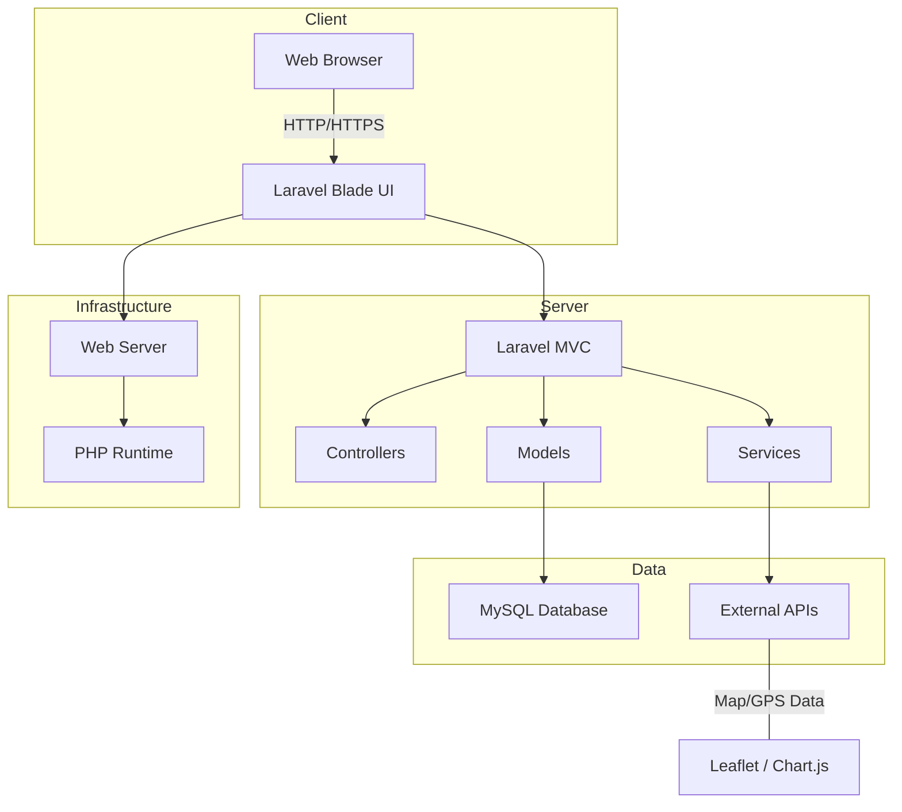
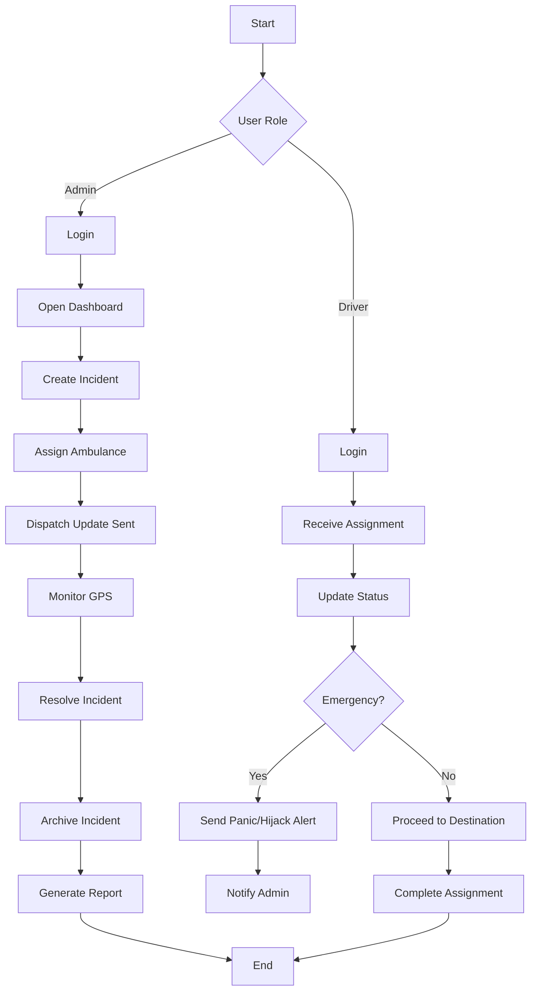
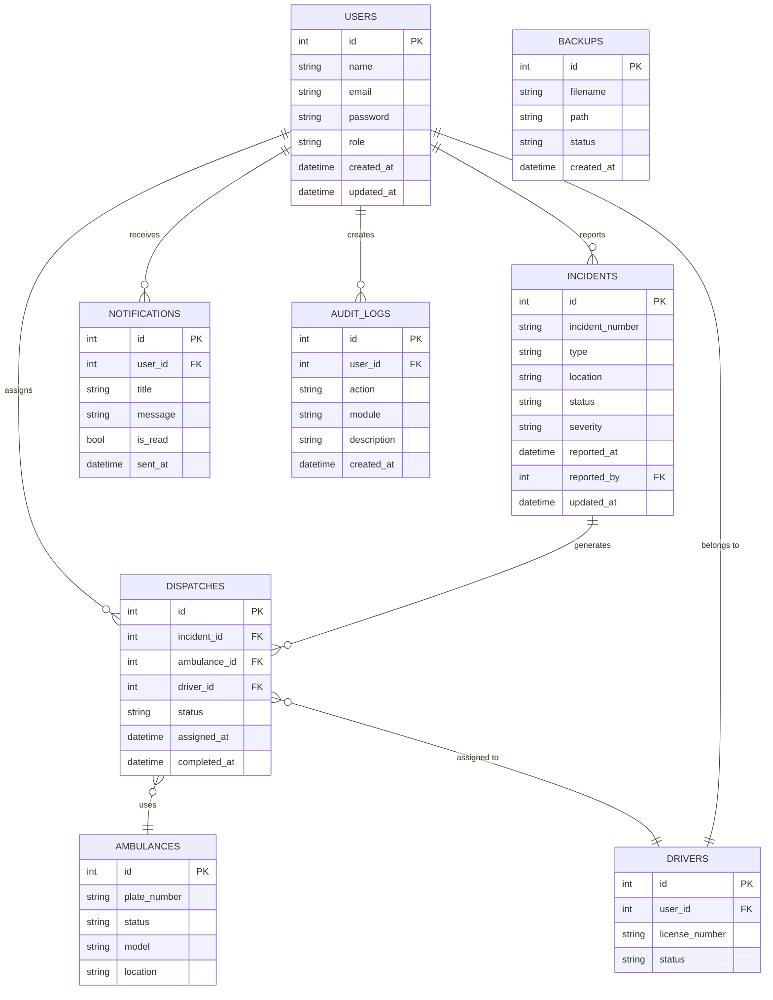
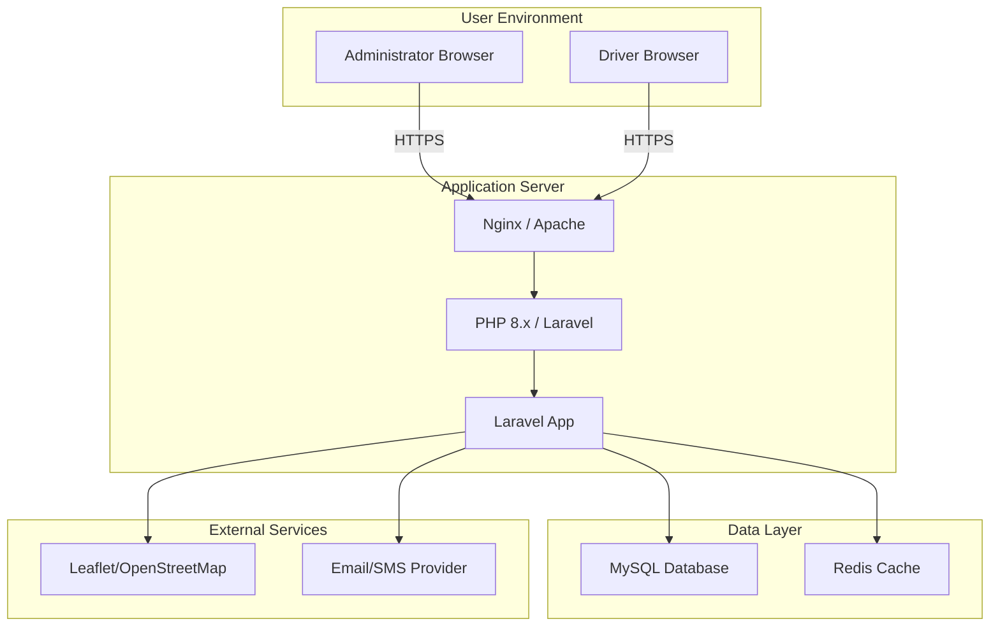
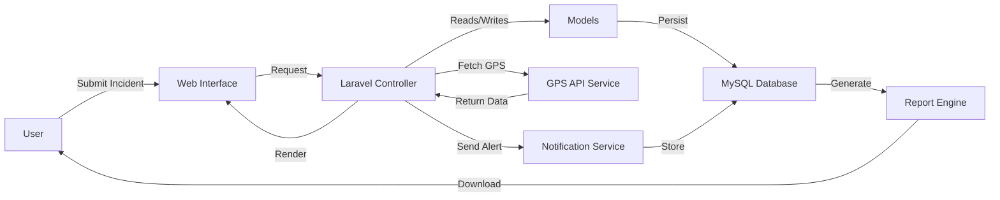

# MuniResQ Capstone Documentation

## Title Page

**Project Title:** MuniResQ

**Course:** Bachelor of Science in Information Technology (BSIT)

**Project Type:** Capstone Project

**Prepared by:** MuniResQ Development Team

**Date:** July 14, 2026

**Institution:** [Your School Name]

---

## Table of Contents

1. Executive Summary
2. System Overview
3. System Architecture Diagram
4. Use Case Diagram
5. Activity Diagram
6. Entity Relationship Diagram
7. Deployment Diagram
8. Data Flow Diagram
9. Testing Plan
10. User Acceptance Testing
11. Functional Requirements
12. Non-Functional Requirements
13. Conclusion
14. References

---

## 1. Executive Summary

MuniResQ is a municipal emergency dispatch and response management system designed to serve local government units (LGUs), emergency operations centers (EOCs), ambulance fleets, and field personnel. The system centralizes incident reporting, dispatch coordination, live GPS tracking, panic/hijack alert handling, notification management, and reporting.

This documentation provides a full capstone overview covering system architecture, use cases, workflow activities, entity relationships, deployment configuration, data flow, testing strategy, user acceptance criteria, and both functional and non-functional requirements.

---

## 2. System Overview

MuniResQ supports three primary user roles:

- **Administrator / EOC Dispatcher**: Oversees incidents, dispatches vehicles, monitors live operations, and manages personnel.
- **Driver / Field Responder**: Receives assignments, updates status, and triggers panic or hijack alerts.
- **System / Audit Manager**: Manages notifications, audit logs, and reporting.

Key features include:

- Incident management and dispatch coordination
- Live GPS tracking for ambulances and incidents
- Panic and hijack alert systems
- Analytics dashboards with response load and dispatch status
- Notification and operations log tracking
- Backup, restore, and reporting capabilities

---

## 3. System Architecture Diagram

### Description

The system architecture illustrates the layered structure of the MuniResQ application, showing how the web client, server, services, and data storage interact. The application follows a modern MVC and service-oriented architecture.

### Diagram



---

## 4. Use Case Diagram

### Description

The use case diagram captures the interactions between the system and its users. It highlights main processes such as incident creation, dispatch management, GPS monitoring, alert triggering, and reporting.

### Diagram

```mermaid
usecaseDiagram
    actor Admin as A
    actor Driver as D
    actor System as S

    A --> (Login)
    A --> (View Dashboard)
    A --> (Create Incident)
    A --> (Assign Dispatch)
    A --> (Monitor GPS)
    A --> (Manage Notifications)
    A --> (Generate Reports)
    A --> (View Audit Logs)

    D --> (Login)
    D --> (Receive Assignment)
    D --> (Update Status)
    D --> (Trigger Panic Alert)
    D --> (Trigger Hijack Alert)
    D --> (View Incident Details)

    S --> (Perform Backup)
    S --> (Restore System)
```

---

## 5. Activity Diagram

### Description

The activity diagram shows the flow of user actions during incident creation and dispatch execution, including live monitoring and alert handling.

### Diagram



---

## 6. Entity Relationship Diagram

### Description

The ERD identifies the main data entities, their attributes, and relationships. The model supports incidents, dispatches, ambulances, drivers, notifications, users, and audit logs.

### Diagram



---

## 7. Deployment Diagram

### Description

The deployment diagram describes how the application is hosted, how the web server interfaces with the database and external map services, and how clients interact with the system.

### Diagram



---

## 8. Data Flow Diagram

### Description

The data flow diagram explains the movement of information inside the system from user interactions through service endpoints to persistent storage and reporting.

### Diagram



---

## 9. Testing Plan

### 9.1 Objectives

- Validate system functionality against requirements.
- Ensure data integrity and security across workflows.
- Confirm usability for administrative and driver users.
- Verify performance for critical dashboard operations.

### 9.2 Scope

- Functional testing of incident, dispatch, alert, and reporting modules.
- Integration testing of dashboard charts, live map, and external services.
- Regression testing after bug fixes and UI redesign.
- Security testing for authentication, authorization, backup, and restore.
- Usability testing for EOC and driver workflows.

### 9.3 Test Types

- **Unit Testing**: Validate models, controllers, and service methods.
- **Feature Testing**: Confirm dashboard views, form submissions, and API endpoints.
- **Integration Testing**: Check interactions between database, map service, and notification service.
- **System Testing**: End-to-end verification of user flows.
- **Acceptance Testing**: Validate business requirements and user expectations.
- **Performance Testing**: Evaluate dashboard refresh and map loading under load.
- **Security Testing**: Assess access control, session handling, and backup restore protection.

### 9.4 Test Environment

- **Platform**: Windows development environment with Laragon
- **Web Server**: Apache or Nginx
- **Language**: PHP 8.x
- **Framework**: Laravel 12
- **Database**: MySQL / MariaDB
- **Testing Tools**: PHPUnit, Laravel Dusk (optional), Postman

### 9.5 Test Cases

#### 9.5.1 Login and Authentication

- TC01: Successful admin login with valid credentials.
- TC02: Driver login and session persistence.
- TC03: Access control prevents unauthorized pages.

#### 9.5.2 Incident Management

- TC04: Create incident with valid data.
- TC05: Update incident status.
- TC06: Close incident and record history.
- TC07: Invalid incident data returns validation error.

#### 9.5.3 Dispatch Workflow

- TC08: Assign dispatch to ambulance and driver.
- TC09: Driver receives assignment and updates status.
- TC10: Dispatch completed successfully.

#### 9.5.4 GPS and Map

- TC11: Live command map loads without error.
- TC12: Ambulance GPS markers appear on the map.
- TC13: Incident markers show correct coordinates.

#### 9.5.5 Alerts

- TC14: Panic alert triggers notification.
- TC15: Hijack alert triggers notification.
- TC16: Admin receives and views active alerts.

#### 9.5.6 Notifications and Audit

- TC17: Create and view notifications.
- TC18: Mark notification as read.
- TC19: Audit log records user actions.

#### 9.5.7 Reports and Backup

- TC20: Generate PDF incident report.
- TC21: Download Excel export.
- TC22: Create and restore backup safely.

### 9.6 Acceptance Criteria

- All critical workflows complete successfully.
- No fatal runtime errors on dashboard load.
- Data updates reflect in real-time dashboard counters.
- Security checks pass for authentication and backup restore.
- User interface is usable for admin and driver roles.

---

## 10. User Acceptance Testing

### 10.1 Purpose

To confirm MuniResQ meets stakeholder expectations for LGU emergency dispatch operations, field responder workflows, and reporting.

### 10.2 Testing Team

- Project Sponsor / LGU Representative
- Emergency Operations Commander
- Ambulance Dispatcher
- Field Driver Representative
- Development QA Lead

### 10.3 UAT Scenarios

#### UAT01: Admin Dashboard Operation

- Step 1: Login as Admin.
- Step 2: View live dashboard and verify metrics.
- Step 3: Confirm incident counts and dispatch summaries.
- Step 4: Validate map marker refresh.
- Expected Result: Dashboard loads correctly with live data.

#### UAT02: Incident Creation and Dispatch

- Step 1: Create a new incident.
- Step 2: Assign an ambulance and driver.
- Step 3: Confirm dispatch appears in active queue.
- Expected Result: Dispatch is created and visible.

#### UAT03: Driver Status Update

- Step 1: Login as Driver.
- Step 2: Accept assignment.
- Step 3: Mark status en route and completed.
- Expected Result: Status updates reflect on dashboard.

#### UAT04: Panic and Hijack Alerts

- Step 1: Driver triggers a panic alert.
- Step 2: Admin views alert on dashboard.
- Expected Result: Alert is delivered and logged.

#### UAT05: Reporting and Notification

- Step 1: Generate a PDF incident report.
- Step 2: Create a system notification.
- Step 3: View notifications and audit log.
- Expected Result: Reports download successfully and notifications are recorded.

### 10.4 UAT Acceptance Criteria

- System supports critical emergency workflows.
- Users can complete tasks with minimal guidance.
- No major usability issues are found.
- All High-priority defects are resolved.
- Stakeholders sign off on the application.

---

## 11. Functional Requirements

### 11.1 User Authentication

- FR1: The system shall allow administrators and drivers to log in with secure credentials.
- FR2: The system shall enforce role-based access control.
- FR3: The system shall support password reset and account management.

### 11.2 Incident Management

- FR4: The system shall enable administrators to create, update, and close incidents.
- FR5: The system shall store incident location, type, status, severity, and reporter.
- FR6: The system shall display active incidents on the dashboard.

### 11.3 Dispatch Coordination

- FR7: The system shall allow dispatch assignment to drivers and ambulances.
- FR8: The system shall track dispatch status from assigned to completed.
- FR9: The system shall allow drivers to update dispatch progress.

### 11.4 Live GPS Tracking

- FR10: The system shall display ambulance and incident locations on a live map.
- FR11: The system shall update map coordinates regularly.
- FR12: The system shall fit the map view to active markers.

### 11.5 Alert Management

- FR13: The system shall allow drivers to trigger panic alerts.
- FR14: The system shall allow drivers to trigger hijack alerts.
- FR15: The system shall notify administrators upon alert activation.

### 11.6 Notifications and Logs

- FR16: The system shall send notifications to users about critical updates.
- FR17: The system shall record audit logs for significant actions.
- FR18: The system shall allow users to view and mark notifications.

### 11.7 Reporting and Export

- FR19: The system shall generate PDF and Excel reports for incidents and operations.
- FR20: The system shall allow users to download report files.
- FR21: The system shall support exporting active dispatch and alert summaries.

### 11.8 Backup and Restore

- FR22: The system shall allow administrators to create database backups.
- FR23: The system shall allow administrators to restore backups securely.
- FR24: The system shall validate backup files before restoration.

---

## 12. Non-Functional Requirements

### 12.1 Performance

- NFR1: The dashboard shall load within 3 seconds under standard load.
- NFR2: Live map and KPI charts shall refresh every 10 seconds without a full page reload.
- NFR3: Backup creation shall complete within 5 minutes for standard datasets.

### 12.2 Security

- NFR4: The system shall use HTTPS for all client-server communication.
- NFR5: Passwords shall be stored using strong hashing.
- NFR6: The system shall prevent unauthorized role access.
- NFR7: Backup restore operations shall require administrator permission.

### 12.3 Usability

- NFR8: The user interface shall be accessible and intuitive for EOC operators.
- NFR9: The system shall use clear labels and status indicators.
- NFR10: The system shall provide feedback messages for all critical actions.

### 12.4 Reliability

- NFR11: The system shall be available at least 99% of working hours.
- NFR12: Data consistency shall be maintained across incident and dispatch records.
- NFR13: The system shall log and report errors for investigation.

### 12.5 Maintainability

- NFR14: The application code shall follow Laravel and PSR coding standards.
- NFR15: The system shall use modular services for GPS, notifications, and reporting.
- NFR16: The system shall provide documentation for deployment and testing.

### 12.6 Scalability

- NFR17: The architecture shall allow scaling the web server and database as demand grows.
- NFR18: The system shall support adding new incident types and reporting modules.

---

## 13. Conclusion

MuniResQ is a comprehensive EOC-grade emergency response system designed for modern LGU operations. This capstone documentation defines system design, diagrams, testing strategy, and requirement coverage to support deployment, evaluation, and final acceptance.

The architecture emphasizes secure role-based access, real-time incident monitoring, reliable dispatch workflows, and audit-ready reporting. It is structured to support phased improvement toward full production readiness.

---

## 14. References

- Laravel Documentation
- Bootstrap 5 Documentation
- Leaflet.js Documentation
- Chart.js Documentation
- System Requirement Specifications (SRS)
- Local Government Emergency Operations Center Best Practices
